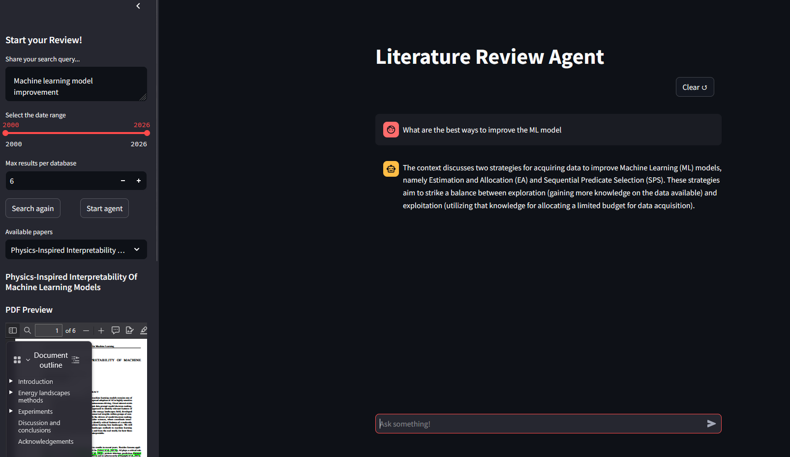

# Fast Run (Docker Compose)

## 1) Edit `.env`

Set these values:

- `NEO4J_PASSWORD` = a password you choose (used for Neo4j login)
- `COHERE_API_KEY` = Cohere API key (create at https://dashboard.cohere.com/api-keys)
- `GROQ_API_KEY` = Groq API key (create at https://console.groq.com/keys)

## 2) Build and start

From the repo root:

```powershell
docker compose up -d --build
```

## 3) Pull the Ollama model (first run only)

```powershell
docker compose exec -T ollama ollama pull mistral
```

## 4) Open the UI / Neo4j

- UI: http://localhost:5000
- Neo4j Browser: http://localhost:7474 (user: `neo4j`, password: `NEO4J_PASSWORD`)

## 5) Dev loop (code-only changes)

No rebuild needed for code edits (repo is bind-mounted). Restart the app if Streamlit doesn’t auto-reload:

```powershell
docker compose restart app
```
## 6) Important Notes

- Remove the `gpus` section from ollama in `docker-compose.yml` if you are not using a GPU and have CUDA installed. Model will run on CPU.

## Example Run

- Open the UI: at `http://localhost:5000` and search `Machine learning model improvement` with date range `2000-2026` and max 6 results per database.
- When papers are found click the appeared `Start Agent`button and wait for it to finish knowledge base.
- On the right side ask the literature review agent `What are the best ways to improve ML models?`

Example output looks like the following image:

